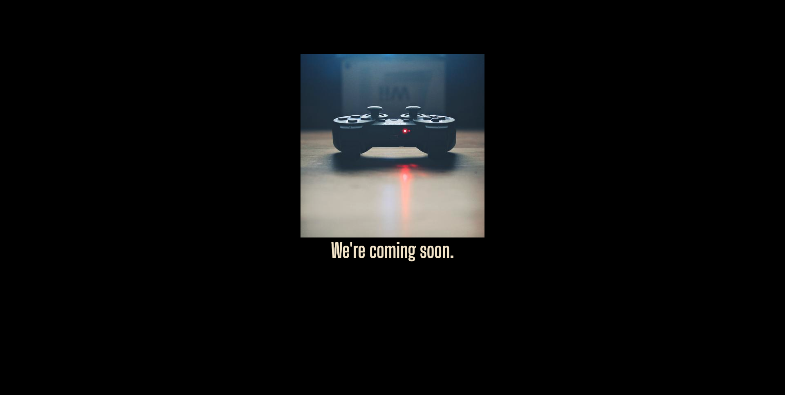

# Coming soon template

Simple coming soon page. Just logo and title centered in vertical and horizontal.


> Photo generated automatically [http://unsplash.it/450/450?random&gravity=center](http://unsplash.it/450/450?random&gravity=center)

## What do you need to do

### Generate favicon

Generate your favicon from [https://realfavicongenerator.net/](https://realfavicongenerator.net/) and replace the folder with `images/favicon` folder

### Colors

**Background color:** default is `#000000` search and replace it
**Font color:** default is `#f1e7cd` search and replace it

### Font

Default font **Big Shoulders Display**

```html
<link
      href="https://fonts.googleapis.com/css2?family=Big+Shoulders+Display:wght@300;400;500;600&display=swap"
      rel="stylesheet"
    />

<style>
    body {
        font-family: "Big Shoulders Display", cursive;
    }
</style>
```

### Header

```html
<title>Website - Coming soon</title>
<meta name="description" content="cooming soon" />
<meta name="author" content="your name" />
```

### Body

```html

<h1>Replace with your coming soon text</h1>
```
